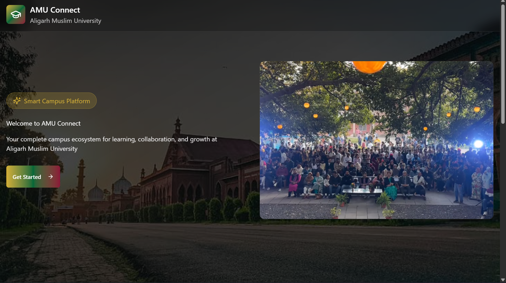

# AMU CONNECT

<p align="center">
  <strong>A Unified Digital Platform for Aligarh Muslim University</strong>
</p>

<p align="center">
  <em>Consolidating the fragmented university ecosystem into a centralized, database-driven system managing the entire student lifecycle.</em>
</p>



# AMU Connect

AMU Connect is a centralized student lifecycle management system designed for Aligarh Muslim University (AMU). It brings major student-related processes into a single platform, from admission verification to enrollment, hostel allocation, and student services.

## Features

- **Role-Based Access**  
  Separate interfaces and workflows for Students, Faculty, and Administrators.

- **Admission Verification**  
  Students can verify their admission status using their entrance roll number.

- **Admission Result**  
  Displays the student's admission decision and relevant admission details.

- **Fee Payment**  
  Accepted students can view their applicable fee and complete the payment process.

- **Enrollment**  
  After successful fee payment, an enrollment number is generated and stored in the database.

- **Hostel Allocation**  
  Eligible students can be assigned hostel and room details after enrollment.

- **Student Dashboard**  
  Provides students with their academic and administrative information in one place.

- **Database-Driven System**  
  Student and admission information is retrieved from PostgreSQL through Supabase instead of relying on static mock data.

## Student Lifecycle

```text
Admission Verification
        ↓
Admission Result
        ↓
Fee Payment
        ↓
Enrollment
        ↓
Hostel Allocation
        ↓
Student Dashboard
```
## Tech Stack

### Frontend

- React
- TypeScript
- Tailwind CSS
- Vite
- Framer Motion
- Lucide React

### Backend & Database

- Supabase
- PostgreSQL
- Supabase Authentication
- Row Level Security (RLS)

### Deployment

- Vercel

## Database

The system uses PostgreSQL through Supabase.

Major tables include:

| Table | Purpose |
|---|---|
| `profiles` | Stores user profile information |
| `departments` | Stores university departments |
| `programs` | Stores academic programs |
| `courses` | Stores course information |
| `applications` | Stores admission applications |
| `students` | Stores enrolled student information |
| `fee_structures` | Stores program-wise fee details |
| `payments` | Stores student payment records |
| `enrollments` | Stores enrollment information |
| `hostels` | Stores hostel information |

Reference data such as departments, programs, and fee structures is maintained in the database. Transactional records such as payments and enrollments are created as students progress through the system.

## Project Structure

src/
```text
├── components/
│   ├── RoleBasedAuthPage.tsx
│   ├── StudentAdmissionVerification.tsx
│   ├── StudentAdmissionResult.tsx
│   ├── StudentFeePayment.tsx
│   ├── StudentEnrollment.tsx
│   ├── StudentDashboard.tsx
│   └── ...
│
├── lib/
│   └── supabase.ts
│
├── types/
│   └── student.ts
│
└── ...
```

## Admission Flow

1. The student enters their entrance roll number.
2. The system checks the `applications` table.
3. The admission status is displayed.
4. If accepted, the student proceeds to fee payment.
5. After successful payment, an enrollment record is created.
6. The system generates an enrollment number.
7. Hostel allocation is completed.
8. The student can access their dashboard.

## Environment Variables

Create a `.env` file and add the Supabase credentials:

```env
VITE_SUPABASE_URL=your_supabase_url
VITE_SUPABASE_ANON_KEY=your_supabase_anon_key
```

Do not commit `.env` files or expose private credentials.

## Installation

Clone the repository:

```bash
git clone <repository-url>
cd amu-connect
```
Install dependencies:

```bash
npm install
```
Start the development server:

```bash
npm run dev
```
The application will be available at the local Vite development URL.

## Build

To create a production build:

```bash
npm run build
```
To preview the production build:

```bash
npm run preview
```

## Project Status

AMU Connect is being developed as a student lifecycle management platform for AMU. The core workflow covers:

```text
Admission → Fee Payment → Enrollment → Hostel → Dashboard
```
Further modules can be added for academic records, attendance, courses, fees, faculty operations, and administration.

## Team

### Team Unchecked Error

- [Maria Ali](https://github.com/mariaali111)
- [Sadia Peerzada](https://github.com/sadiapeerzada)
- [Maariyah Anjum Faizan](https://github.com/maariyahfaizan)

Developed for AMU Hackathon 2026.

---
